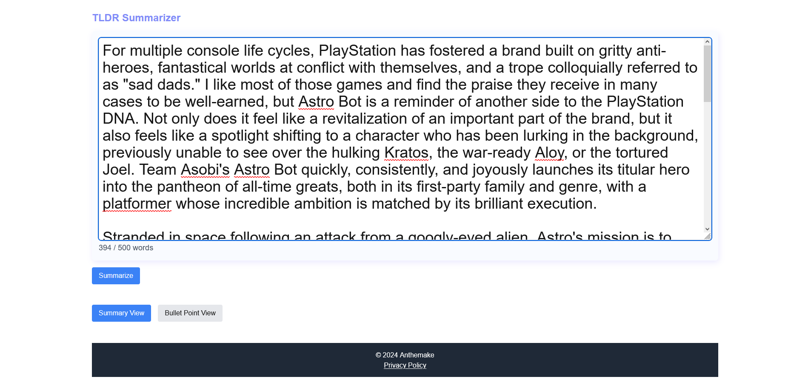
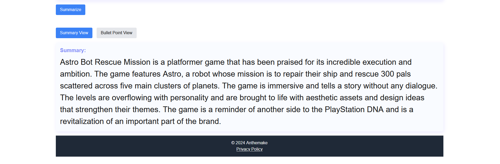
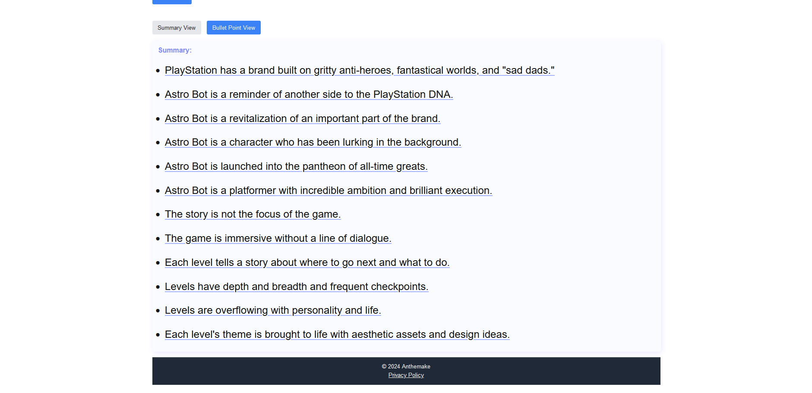

# TLDR Summarizer App

## Introduction

This Text Summarizer is a web-based application utilizing Azure Cognitive Services and OpenAI. It showcases the application of AI in natural language processing.

## Technologies Used

**Next.js**: For the frontend and server-side logic

**Tailwind CSS**: For quick styling

**Azure AI**: Leveraging Azure Cognitive Services for AI-driven text summarization

**Git**: For version control

## Features

**Text Summarization**: Converts large text into concise summaries.

**Bullet Points Generation**: Extracts key points as bullet lists.

**Responsive Design**: Fully adaptable to mobile and desktop devices.

**Security**: Implements security practices such as rate limiting character escaping to prevent resource abuse.

## Demo

[_Using the first four paragraphs of the Gamespot review of AstroBot PS5. Very cool game!_](https://www.gamespot.com/reviews/astro-bot-review-fly-me-to-the-moon/1900-6418277/)

  

  

## Installation and Setup

Clone the repository and install dependencies:

> git clone https://yourrepositorylink.git

> cd text-summarizer

> npm install

### Usage

To run the application locally:

> npm run dev

Navigate to http://localhost:3000 in your browser to view the app.

### Code Examples

GDPR compliance and guidance implemented via Footer due to rateLimiter.ts component and the storage of data with Azure CosmosDB:

>
> // Hash the IP address before storing it
>
> export function hashIP(ip: string): string {
> return crypto.createHash('sha256').update(ip).digest('hex');
> }
>
> // Function to check and update the rate limit based on hashed IP
>
> export async function checkRateLimit(ip: string): Promise<{ perMinute: boolean; perHour: boolean }> {
> const container = client.database(databaseId).container(containerId);
> const hashedIP = hashIP(ip); // Hash the IP
>
> const currentTime = Date.now();
> const oneMinuteAgo = currentTime - 60 _ 1000;
> const oneHourAgo = currentTime - 60 _ 60 _ 1000;
> const oneDayInMilliseconds = 24 _ 60 _ 60 _ 1000; // 24 hours
>}
> // ...additional code
>
> // storing data into Azure CosmosDB
>
> if (!rateLimitData) {
>
> // No record exists; create a new one
>
> const newRecord = {
>   id: hashedIP,
>   ip: hashedIP,
>   requestCountMinute: 1,
>   requestCountHour: 1,
>   lastRequestTime: currentTime,
> };
>}
> // ...additional code
>

## Future Implimentations

- Visual upgrades

- Increase word limit

## License

This project is licensed under the MIT License. See the [LICENSE](LICENSE) file for details.
